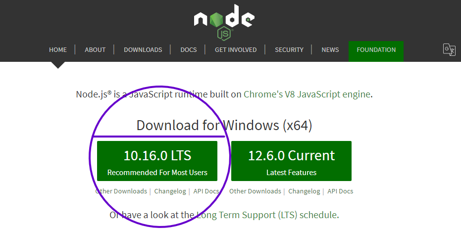
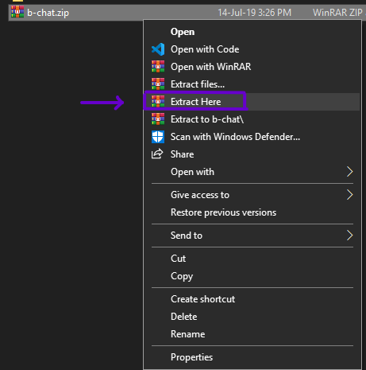
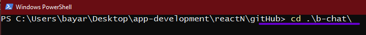
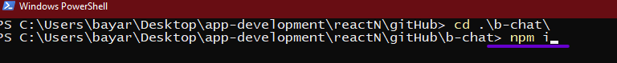
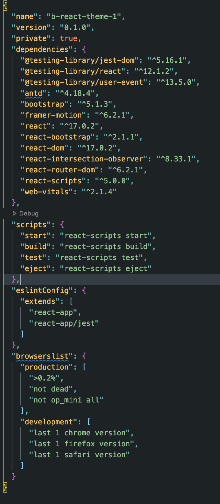

# Quick Start

# Requirements

This Template is for React Native which requires the following to run, all the items are clickable for their own documentation which you need to follow:

- [Node](https://nodejs.org/)
  - Node is an npm manager that you can use to install dependencies. - Download the LTS version on [nodejs.org](https://nodejs.org/)
    

- [React](https://reactjs.org/)
  - React lets you build web applications using only JavaScript.
    - documentation for React is available on their Website

# Installation

> Download the B React Theme 1 Zip file from Code Canyon

- Extract the zip file
  - right-click on the zip file and then click on extract
    
- Open CMD / Terminal then [navigate](https://www.digitalcitizen.life/command-prompt-how-use-basic-commands) to the extracted folder
  - write:  <Code>cd filename</Code>
    
- Type `npm i` in the Terminal / CMD window and press enter
  

> Preferred dependency versions

package.json

# Run

> - ### development

- Run npm start

> - ### production

- Run <code>npm run build</code>
- Run <code>serve -s build</code>
